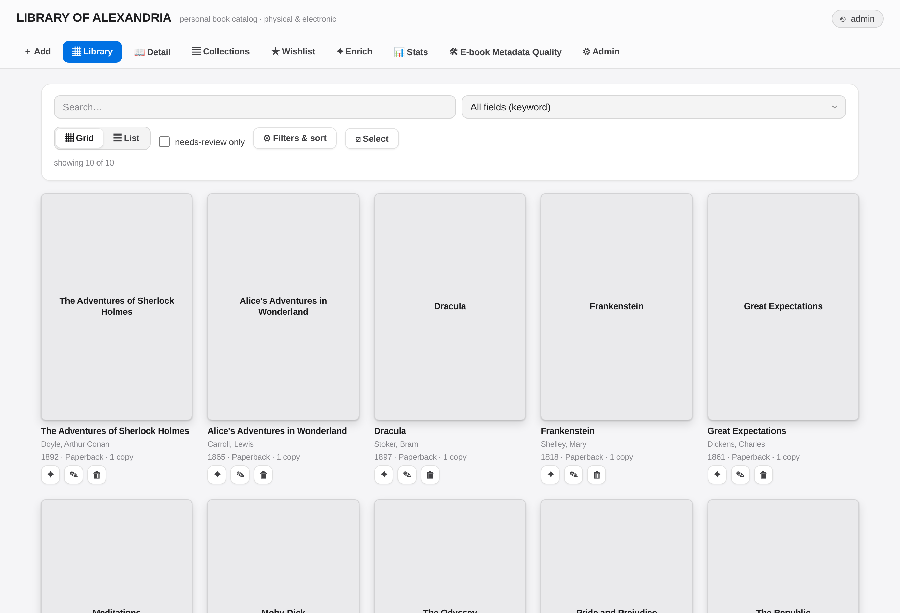
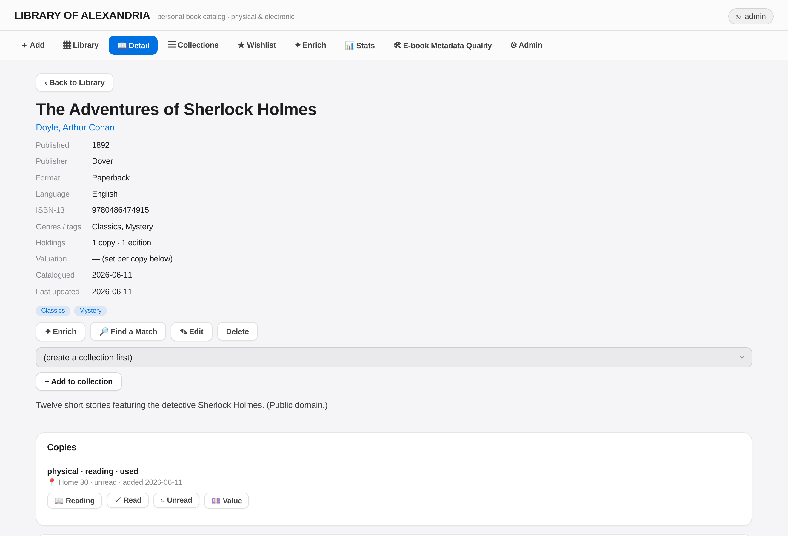

# Library of Alexandria

A self-hosted web app for cataloguing your **personal book collection** — physical books
and e-books — and finding anything in seconds. It runs entirely on your own machine with
Docker, works offline, and installs to your phone as a PWA.

> **License — please read.** This project is **source-available, not open source**. It is
> free for **one individual to use at home for private, non-commercial purposes** (managing
> your own book collection), and you may inspect the code for security. **Any** other use —
> business, institutional, charity, non-profit, educational, or providing a service to
> others — requires a separate written license. See [LICENSE](LICENSE).

---

## Screenshots

The **Library** — your whole collection, searchable, filterable and sortable:



A book's **Detail** page — the complete record, with copies, locations and one-click actions:



---

## Features

- **Catalogue** physical copies and e-books in one place (a Work → Edition → Copy model, so
  multiple copies/editions of the same book are handled cleanly).
- **Powerful search, filter & sort** over every field, with friendly menus and a full-text
  search that tolerates typos and works in any language (incl. Greek and accented text).
- **Grid & List views** plus a rich **Detail** page with the full record.
- **Covers**: upload an image or snap a photo with your phone's camera; replace or delete.
- **Online metadata enrichment (opt-in)** from OpenLibrary, Google Books, the Library of
  Congress, the German National Library (DNB), and Greek catalogues — with a review/diff
  step before anything is saved. Nothing is fetched during import.
- **Add by ISBN, by barcode photo, or by title/author search**, with **duplicate detection**
  (tells you if you already own a book, and where it is shelved).
- **E-books**: point it at a folder, scan embedded metadata, and tidy filenames; open files
  by format (EPUB/PDF/AZW3…) straight from a book's page.
- **Wishlist, collections, reading status, and per-copy valuation.**
- **3D shelf map** to locate where a book physically lives (a generic example room is
  included; you can model your own).
- **Stats dashboard** and a **data dictionary** of the whole catalogue.
- **12 themes/skins**, installable **PWA**, and **multi-user** accounts (admin / user /
  read-only).
- **CSV import/export** and one-command **backup/restore**.

## Requirements

- [Docker](https://docs.docker.com/get-docker/) and Docker Compose (v2).
- ~1 GB of disk for the images and database. That's it.

## Quick start

```bash
# 1. Get the code
git clone https://github.com/Statisticonomicon/library-of-alexandria.git
cd library-of-alexandria

# 2. Create your config
cp .env.example .env

# 3. Stand it up (builds, starts the database + app, seeds a few sample books,
#    creates an admin account and prints its one-time password)
./setup.sh
```

Then open **http://localhost:5001**, log in with `admin` and the password `setup.sh`
printed, and change it from the **Account** tab.

A handful of public-domain sample books are added so the app isn't empty on first run —
delete them once you start adding your own.

> **Reaching it from other devices.** By default the app binds to `localhost` only. To use
> it from your phone or another computer, either set `LOA_BIND_IP` in `.env` to a private
> LAN/VPN address, or (recommended) put it behind a reverse proxy that terminates HTTPS.
> Installing the PWA and using the camera require HTTPS.

## Using it

- **Add a book** — the **+ Add** tab: type an ISBN and **Look up**, **scan a barcode**
  photo, or **search by title/author**. Review the details and save. If you already own it,
  a banner tells you where your copies are.
- **Enrich** existing books — open a book → **Enrich** (or **Find a Match**) to pull
  covers and metadata from online sources. You review and pick what to apply.
- **E-books** — set your e-book folder under **Admin → E-book folder**, then scan it. Open
  files from a book's Detail page.
- **Back up** — `./backup.sh` writes a full database dump plus CSV copies to `backups/`.
  Restore with `./restore.sh backups/loa-<timestamp>.sql`.

## Configuration

All settings live in `.env` (copied from `.env.example`). The important ones:

| Variable | What it does |
|---|---|
| `SECRET_KEY` | Signs login sessions. `setup.sh` generates one automatically. |
| `LOA_BIND_IP` / `LOA_PORT` | Where the app listens (default `localhost:5001`). |
| `MEDIA_HOST_DIR` | The host folder mounted as your e-book library (default `./ebooks`). |
| `POSTGRES_PASSWORD` | Database password — change it if you expose the DB. |
| `GOOGLE_BOOKS_API_KEY` | Optional, raises Google Books rate limits. |
| `LIBRARYTHING_TALPA_TOKEN` | Optional, enables natural-language "describe a book" search. |

## Security

The app keeps everything on your own machine. Please review
[SECURITY.md](SECURITY.md) for how to report a vulnerability. You are encouraged to read the
source and verify it before trusting it with your data.

## License

Personal, non-commercial, home use only. See [LICENSE](LICENSE). For any other use, contact
**Konstantinos Bonikos &lt;k.bonikos@protonmail.ch&gt;**.
